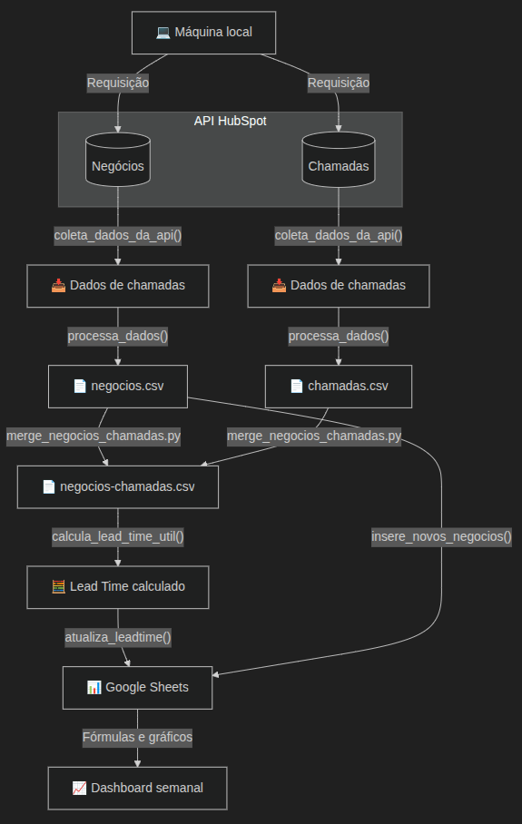

## 1. Introdução

### Problema

- A ausência de automação na coleta e atualização desses dados gerava retrabalho manual, atrasos nas análises e risco de inconsistência entre bases.
- As informações de negócios e chamadas da plataforma HubSpot não estavam organizadas de forma acessível e integrada para análises operacionais.
- Falta de visibilidade clara sobre o tempo entre a criação do lead e o primeiro contato, dificultando o acompanhamento de métricas de desempenho.

### Objetivo

O objetivo deste projeto é desenvolver um pipeline funcional de dados que colete informações das APIs de "negócios" e "chamadas" da plataforma HubSpot, processe, trate e exporte integre dados com uma planilha Google Sheets. O foco principal é garantir que toda a execução do processo ocorra de forma completamente automática.

A imagem a seguir mostra o fluxo dos dados desse projeto:



### Ferramentas

- `HubSpot` — Fonte dos dados de negócios e chamadas, acessados via requisições às APIs 
- `Python` — Orquestrar as etapas de coleta, tratamento e exportação.
- `requests` — Biblioteca utilizada para realizar as requisições HTTP aos endpoints da API do HubSpot.
- `pandas` — Manipulação e limpeza de dados estruturados em formato tabular (.csv).
- `gspread` — Integração com o Google Sheets para leitura e escrita automatizada.
- `"Acompanhamento métricas-chave aMORA - 2025 - Lead time"` — Google Sheets
- `cronitor + cronjob` — Agendamento automático do pipeline em horários definidos.


## 2. Conexão com APIs HubSpot

Para a coleta dos dados foram utilizadas os seguintes endpoints de APIs do HubSpot:

- [https://api.hubapi.com/crm/v3/objects/deals](https://api.hubapi.com/crm/v3/objects/deals)
- [https://api.hubapi.com/crm/v3/objects/calls](https://api.hubapi.com/crm/v3/objects/calls)


Para viabilizar o acesso seguro aos dados disponibilizados pela API do HubSpot, foi necessário gerar um token de autenticação do tipo Private App Token. Embora já existissem outros aplicativos conectados à conta da aMORA, optou-se pela criação de um novo aplicativo dedicado exclusivamente a este projeto. Essa decisão teve como objetivo evitar impactos indesejados em integrações existentes e manter a organização e rastreabilidade do uso da API para fins analíticos.

Após a configuração do token de acesso, foi desenvolvido um endpoint de teste utilizando o framework FastAPI, localizado no arquivo `app/api/teste_api.py`, com o objetivo de validar a conectividade com a API do HubSpot e a estrutura dos dados retornados.

Esse endpoint executa requisições `GET` ao endpoint de negócios (`deals`) da API da HubSpot:

```http
GET /hubspot/deals?after=2025-07-01&max_results=100
```

Dessa forma, permitindo parametrizar a data de corte (`after`) e o número máximo de resultados (`max_results`). A função realiza paginação automática e filtra apenas os registros modificados após a data fornecida.

Para iniciar o servidor local, basta rodar o comando:

<!-- termynal -->
``` bash
uvicorn teste_api:app --reload
```
E acessar clicando no link http

## 3. Coleta, tratamento e exportação

### Coleta

Para coletar os dados mais recentes da HubSpot, foi criada a função `pega_novos_dados()`, dentro do arquivo `app/api/atualiza_2.py`. Essa função é genérica, ou seja, pode ser usada tanto para negócios quanto para chamadas, já que recebe como parâmetro o tipo desejado:

```python
def pega_novos_dados(tipo: str, url: str, props: list, mapa_api_to_csv: dict, after_date: str):
```
Essa função faz as seguintes tarefas:

- Realiza chamadas tipo `POST` à API, buscando registros modificados após uma data específica que é inserida no `payload`.
- Utiliza a propriedade `hs_lastmodifieddate` para comparar com a data inserida no `payload` e devolver apenas as propriedades de um lead modificado após tal data escolhida.

Esse filtro é feito direto na declaração do payload:

```python
payload = {
    "filterGroups": [{
        "filters": [{
            "propertyName": "hs_lastmodifieddate",
            "operator": "GT", # Operador greater than
            "value": iso_date
        }]
    }],
    "properties": props,
    "limit": 100
}
```

- `"propertyName": "hs_lastmodifieddate"` diz à API qual campo filtrar.
- `"operator": "GT"` significa "greater than" (maior que).
- `"value": iso_date` é o valor comparado que vem da variável `after_date` recebida como argumento da função

- Faz a requizição `POST` à API utilizando o `payload`

```python
response = requests.post(f"{url}/search", headers={**HEADERS, "Content-Type": "application/json"}, data=json.dumps(payload))
    if not response.ok:
        raise Exception(f"Erro na API ({tipo}): {response.text}")
```

Note que foi necessário implementar paginação na função, pois a API da HubSpot limita a quantidade de registros por requisição (100 por página).

```python
paging = data.get("paging", {}).get("next", {}).get("after")
if paging:
    after = paging
else:
    print("[3] Fim da paginação")
    break
```


### Tratamento

Ainda dentro da função `pega_novos_dados()` já ocorre um primeiro tratamento de parte dos campos. 

Algumas propriedades retornadas pela API da HubSpot, como `"hubspot_owner_id"` (proprietário do negócio), são fornecidas apenas como identificadores (IDs), sem nomes legíveis. Para lidar com isso, foi criado o arquivo `app/testes/devolve_labels.py`.

Nesse arquivo foram implementadas funções auxiliares como `gerar_owner_map()` e `mostrar_opcoes_propriedade_calls()`, que fazem requisições específicas à API e constroem dicionários de mapeamento entre o ID e seu respectivo nome ou descrição.

Esses dicionários são salvos como variáveis no arquivo `app/api/atualiza_2.py` e utilizados na função `pega_novos_dados()`, que chama outras funções, como `traduzir_valores()`, que recebe o ID original e o converte para um nome que tenha um conteúdo significativo. 

Além disso, as propriedades retornadas pela API, que posteriormente se tornam colunas no arquivo CSV, possuem nomes técnicos definidos pelo padrão do HubSpot. Para tornar esses nomes mais claros e compreensíveis, foi criado manualmente o dicionário `API_TO_CSV`, que atua como mapa de conversão.

Toda esse tratamento ocorre dentro do loop de processamento de dados:

```python
for item in data.get("results", []):
    props_api = item.get("properties", {})
    props_csv = {mapa_api_to_csv.get(k, k): v for k, v in props_api.items()}
    (...)
    props_csv["Proprietário do negócio"] = traduzir_valores(OWNER_MAP, props_api.get("hubspot_owner_id")) # exemplo de uso do map
    (...)

```

### Exportação

Para ter uma melhor visualização dos dados, após a coleta e tratamento, eles são salvos em planilhas locais `negócios.csv` e `chamadas.csv`. Esse processo é realizado principalmente pela função `atualiza_csv` do arquivo `app/api/atualiza_2`, que organiza toda a lógica de leitura, atualização e escrita dos dados no disco.

Antes de salvar os novos dados, é necessário carregar os dados antigos já existentes no arquivo `.csv`, se ele existir. Isso é feito pela função `carrega_csv`.

Com os dados novos e antigos em mãos, o código:

Cria um dicionário onde cada chave é o ID único (`id_coluna`) de um registro já salvo no CSV. Isso permite checar rapidamente se um novo dado já existe ou não:

```python
id_map = {linha[id_coluna]: linha for linha in existentes}
```
Itera por todos os novos registros baixados da API, extraindo o ID único de cada um.:

```python
for novo in novos_dados:
    hs_id = novo.get(id_coluna)
```
Se o ID já estiver presente nos dados antigos, ele atualiza o registro existente com os dados novos:

```python
if hs_id in id_map:
    id_map[hs_id].update(novo)
    atualizados_count += 1
```
Se for um ID novo, o registro é inserido no topo da lista (linha 2 do CSV, logo abaixo do cabeçalho), mantendo os dados mais recentes no topo:

```python
else:
    existentes.insert(0, novo)  # <-- Insere novo no topo (linha 2 do CSV)
    novos_count += 1
```

Ao final do processo:

Todos os dados são salvos no arquivo `.csv`.

Os campos são organizados com base na lista colunas, que garante que todos os campos presentes sejam considerados, mesmo que adicionados dinamicamente em algum ponto.

O arquivo é escrito com `csv.DictWriter`, utilizando `quoting=csv.QUOTE_ALL` para evitar erros com campos que contêm vírgulas ou aspas.

## 4. Cálculo Lead Time

Foi escolhido calcular o Lead Time a partir dos arquivos `.csv` atualizados de negócios e chamadas. Com base nesses dados, é gerado o arquivo `leadtime.csv`, que reúne, entre outras informações:

- A data de criação do lead (do CSV de negócios)
- A data da primeira atividade (do CSV de chamadas)

Essa consolidação permite medir o tempo entre a criação do lead e seu primeiro contato registrado. O arquivo `app/services/leadtime.py` faz as seguintes tarefas:

A função `criar_base_leadtime()`:

- Seleciona apenas colunas relevantes para análise:

```python
colunas_desejadas = [
    "Associated Deal IDs",
    "Associated Deal",
    "Data da atividade",
    "Atividade atribuída a"
]
```

- Ordena da mais antiga para a mais recente.
- Remove chamadas duplicadas por negócio, mantendo a primeira (mais antiga).
- Salva a chamada mais antiga de cada lead no arquivo leadtime.csv

Com as chamadas salvas, a função `completar_data_criacao_em_leadtime()`:

- Lê o leadtime.csv e o negocios.csv.
- Traz as colunas "Data de criação" e "Momento de Compra" para dentro do leadtime.csv.
- Faz um merge (junção) entre eles, conectando cada linha pelo ID do negócio.

```python
df_merged = df_leadtime.merge(
    df_negocios[["ID do registro.", "Data de criação", "Momento de Compra"]],
    how="left",
    left_on="Associated Deal IDs",
    right_on="ID do registro."
)
```

- Reorganiza a ordem das colunas para melhor leitura e salva novamente no `leadtime.csv`.

Após juntar as bases, a função `processar_leadtime_csv()` chama a `calcular_lead_time_util()`que:

Calcula a diferença de tempo útil (em horas e minutos) entre duas datas:

- `data_inicio`: data de criação do lead (vinda de `negocios.csv`)
- `data_fim`: data da primeira atividade (vinda de `chamadas.csv`)

Mas considerando apenas horários úteis:

- Segunda a sexta: 08h às 20h
- Sábado: 08h às 18h
- Domingo: não conta

Passo a passo da execução:

1. Garante que as datas tenham fuso horário UTC

```python
if data_inicio.tzinfo is None:
    data_inicio = data_inicio.replace(tzinfo=UTC)
```

2. Ajusta datas para o horário útil

```python
data_inicio = arredondar_para_periodo_util(data_inicio)
data_fim = arredondar_para_periodo_util(data_fim)
```
- Se `data_inicio` for domingo às 10h → é movida para segunda às 08h.
- Se for terça às 07h → arredonda para 08h.
- Se for depois do horário comercial, joga para o próximo dia útil às 08h.

3. Inicia o cálculo do tempo útil

```python
total = timedelta()
atual = data_inicio
```

4. Percorre os dias entre as datas, checa se é dia útil, checa os limites do dia e vai somando apenas o período dentro desse intervalo

```python
while atual.date() < data_fim.date():
    dia = atual.weekday()
    if dia < 5:  # Segunda a sexta
        ini = max(atual, atual.replace(hour=8, minute=0, second=0, microsecond=0))
        fim = atual.replace(hour=20, minute=0, second=0, microsecond=0)
    elif dia == 5:  # Sábado
        ini = max(atual, atual.replace(hour=8, minute=0, second=0, microsecond=0))
        fim = atual.replace(hour=18, minute=0, second=0, microsecond=0)
    else:  # Domingo
        atual = datetime.combine((atual + timedelta(days=1)).date(), time(0, 0), tzinfo=UTC)
        continue   

    if ini < fim:
        total += fim - ini

    atual = datetime.combine((atual + timedelta(days=1)).date(), time(0, 0), tzinfo=UTC)
```

5. Trata o último dia separadamente após acabar o loop

Por fim, feito o cálculo do leadtime, a `função processar_leadtime_csv()` termina sua execução ordenando o dataframe por Data de criação e salva o resultado final em `leadtime.csv`

## 5. Atualização do Google Sheets

Com os dados atualizados e o Lead Time já calculado, as informações são exportadas automaticamente para uma planilha no Google Sheets, que serve de base para análises semanais visuais. Para realizar essa integração, optou-se pelo uso da biblioteca `gspread`, uma solução segura e eficaz, pois permite:

- Autenticação com credenciais protegidas;
- Escrita direta em planilhas do Google;
- Integração direta no código Python, mantendo todo o projeto centralizado (diferente do uso de Google Apps Script);
- Uso gratuito e com ampla documentação.

Essa abordagem garante praticidade, segurança e escalabilidade no processo de atualização e visualização dos dados.

Para realizar essa conexão, foi necessário acessar o Console do Google Cloud acessando o link a abaixo, criar um novo projeto, habilitar as APIs necessárias e criar as credenciais (OAuth ou Service Account).

[https://console.cloud.google.com/](https://console.cloud.google.com/)

Criado o aplicativo google, foi implementado o código do aqruivo `app/api/google_sheets` que é responsável por atualizar automaticamente uma planilha do Google Sheets com dados de negócios e métricas de Lead Time. Ele utiliza os arquivos `.csv` previamente gerados pelo pipeline (`negocios.csv` e `leadtime.csv`) e exporta as informações para uma aba específica da planilha no Google Drive.

No código, a função `autenticar()` realiza a autenticação com a API do Google via OAuth2, utilizando um arquivo de credenciais (`client_secret.json`) e um token de sessão (`token.json`). Garante acesso seguro e persistente à conta do Google para leitura e escrita em planilhas.

A função `atualizar_negocios()` insere linhas de novos negócios cadastrados no HubSpot que já foram extraídos e salvos no `.csv` local:

Compara os registros do CSV de negócios com os IDs já presentes na planilha:

- Filtra apenas negócios criados em 2025.
- Identifica os novos registros, compara os do CDV de negócios com os IDs já presentes na planilha

```python
ids_sheets = set(df_sheets["ID do registro."])
novos_ids = [id_ for id_ in df_csv["ID do registro."] if id_ not in ids_sheets]
```

- Para cada novo ID, uma nova linha é montada com os dados principais.

```python
for id_ in novos_ids:
    linha_csv = df_csv[df_csv["ID do registro."] == id_].iloc[0]
    nova_linha = [
        linha_csv.get("ID do registro.", ""),
        linha_csv.get("Nome do negócio", ""),
        linha_csv.get("Etapa do negócio", ""),
        linha_csv.get("Data de criação", "").strftime("%Y-%m-%d %H:%M") if pd.notna(linha_csv.get("Data de criação", "")) else "",
        "",  # Semana de criação
        "",  # Mês de criação
        linha_csv.get("status_cadastro", ""),
        linha_csv.get("Momento de Compra", ""),
        linha_csv.get("Proprietário do negócio", ""),
        "",  # Horário Comercial
        "",  # Data da primeira chamada
        "",  # Lead Time (min)
    ]
```
- Insere novas linhas 
- Colunas como "Horário Comercial", "Data da primeira chamada" e "Lead Time" ficam inicialmente em branco para serem preenchidas depois.

Então a função `atualizar_leadtime()`:

- Puxa os dados o arquivo local `leadtime.csv`
- Cria um dicionário auxiliar `lookup` que serve para acessar rapidamente as informações de Lead Time associadas a um ID específico, funciona como uma tabel de consulta

```python
lookup = {
    str(row["Associated Deal IDs"]): {
        "Lead time (min)": row.get("Lead Time (min)", ""),
        "Data da atividade": row.get("Data da atividade", "")
    }
    for _, row in df_csv.iterrows()
}
```
- Para cada linha, verifica se o ID existe em `lookup`. Caso exista, preenche com as informações

```python
for idx, row in df_sheets.iterrows():
    id_ = str(row["ID do registro."]).split('.')[0]
    if id_ in lookup:
        info = lookup[id_]
        df_sheets.at[idx, "Lead time (min)"] = info.get("Lead time (min)", "")
        df_sheets.at[idx, "Data da primeira chamada"] = info.get("Data da atividade", "")
```

- Atualiza a planilha com os valores de leadtime.

Para evitar um problema que ocorria, que as fórumulas apagavam ao inserir uma nova linha no sheets, foram criadas as funções `joga_formulas()`, que escreve funções array do próprio sheets na linha 2, e `limpa_colunas()` que deleta todos os valores da coluna de maneira que a fórmula array adicionada funcione corretamente. 

## 6. Cronjob


## 7. Conclusão